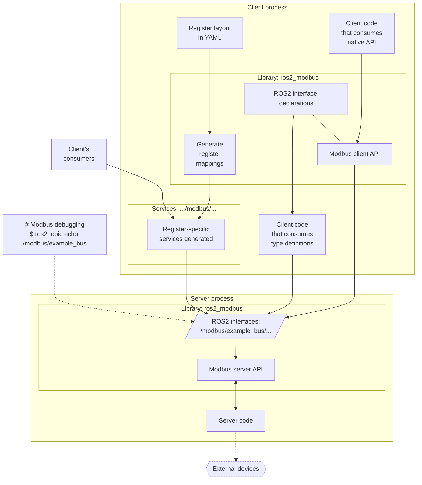

# OpenVMP

This package is a part of [the OpenVMP project](https://github.com/openvmp/openvmp).
But it's designed to be universal and usable independently from the rest of OpenVMP or in a combination with select OpenVMP packages.

## ROS2 Modbus

This package is an ultimate C++ implementation of Modbus for ROS2.

Most server use cases require
[Modbus RTU](https://github.com/openvmp/modbus_rtu) or
[Modbus TCP](https://github.com/openvmp/modbus_tcp) instead. However sometimes
the servers use this library to simulate the devices or to expose a non-Modbus
device using a Modbus interface.

ROS2 clients use this library to communicate with other ROS2 nodes in a way
that is abstracted away from the particular method (RTU or TCP).

### Architecture

The below diagram explains how the modbus library fits into the overall ROS2
architecture both on the client and server sides. See the following sections for
more details.

### Modbus clients

The client may consume ROS type definitions and send the messages directly to
the Modbus service providers using ROS communications.

Alternatively, the client may consume a native API which can send simple
messages.

### Modbus servers

The servers use the modbus library to instantiate ROS2 topics for communication
with clients.

This interface is used by [Modbus RTU](https://github.com/openvmp/modbus_rtu)
and [Modbus TCP](https://github.com/openvmp/modbus_tcp) libraries. But it can be
used to implement alternative access to hardware interfaces that the clients are
expecting to access using Modbus.

### ROS2 interface

Topics:

- /modbus/\<bus-name\>/status/
  - leafs_seen
  - last_leaf
  - last_seen
- /modbus/\<bus-name\>/\<leaf-id\>/
  - last_seen
  - last_function_code
  - last_error_code

Services:

- /modbus/\<bus-name\>/\<leaf-id\>/
  - holding_register_read
  - holding_register_write _(not yet)_
  - holding_register_write_multiple _(not yet)_

### Native interface

The native interface duplicates the ROS2 service interfaces.
The same request and response data types are reused.

### Known Limitations

- As of now, the only supported object type is 'Holding register'
